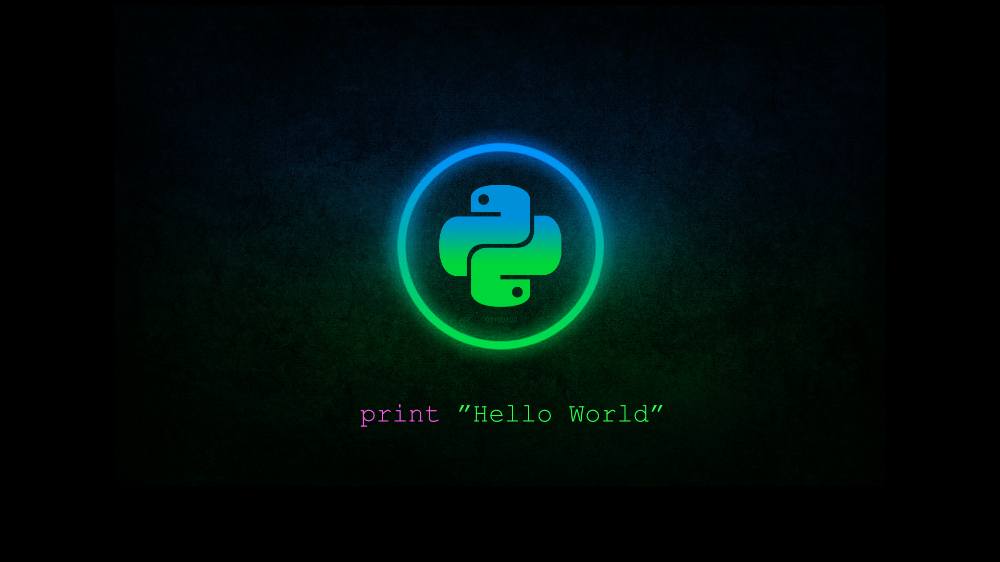

# Code Sleep Python

# Join Slack through this [link](https://join.slack.com/t/code-sleep-python/shared_invite/enQtMjc1NDk2ODk4Mjc2LTI3NmM1OWQ5YjcwYzlkN2YxNmZhNWI2NzE0M2Q4MTNiMzM0Y2RmMzg4YWVkODEwNWI3NTUyN2E0OGY5OWZmZTQ)

## About

This repository contains a curated list of some of the awesome small projects made in Python that you can code away this summer.

It includes analysis of different Python modules, a deep analysis of the Python statistics modules and dataframes like Pandas.

It has some projects on classification, correlation and regression which are the fundamental building blocks of Machine Learning and Neural Networks.

The repository is still under development. Only the source code has been uploaded so far. Implementations and results using Jupyter Notebooks will be implemented shortly.

New to Python? Take a look [here](https://github.com/prateekiiest/Code-Sleep-Python#getting-started-with-python).

## KWOC

We are glad to partner with IIT Kharagpur as a part of the Kharagpur Winter of Code. We are proud to host this Open Source event during the winter months and we hope you have a great winter this year.

#### See Project Ideas [here](https://github.com/prateekiiest/Code-Sleep-Python/wiki/Winter-of-Code-Project)

## Projects

* [Tic-Tac-Toe](https://github.com/prateekiiest/Code-Sleep-Python#tic-tac-toe)
* [Hangman](https://github.com/prateekiiest/Code-Sleep-Python#Hangman)
* [Caesar-Cipher](https://github.com/prateekiiest/Code-Sleep-Python#caesar-cipher)
* [Translations of Hamlet](https://github.com/prateekiiest/Code-Sleep-Python#translations-of-hamlet)
* [Classification](https://github.com/prateekiiest/Code-Sleep-Python#classification)
* [Whisky Classification](https://github.com/prateekiiest/Code-Sleep-Python#whisky-classification)
* [Bird Migration](https://github.com/prateekiiest/Code-Sleep-Python#Bird_mirgation)
* [Social Network Analysis](https://github.com/prateekiiest/Code-Sleep-Python#social_network)
* [Prime](https://github.com/prateekiiest/Code-Sleep-Python#Prime)
* [Website status check](https://github.com/prateekiiest/Code-Sleep-Python#website_status_check)
* [Encryption-Techniques](#Encryption-Techniques)
* [Inception Tic-Tac-Toe](https://github.com/prateekiiest/Code-Sleep-Python#inception_tic-tac-toe)
* [Sprint](https://github.com/prateekiiest/Code-Sleep-Python#sprint)

----------------------------------

### Tic-Tac-Toe

Tic-Tac-Toe (or noughts and crosses) is a simple strategy game in which two players take turns placing a mark on a 3x3 board, attempting to make a row, column, or diagonal of three with their mark. In this homework, we will use the tools we've covered in the past two weeks to create a Tic-Tac-Toe simulator and evaluate basic winning strategies.

 Players soon discover that best play from both parties leads to a draw. Because of the simplicity of Tic-Tac-Toe, it is often used as a pedagogical tool for teaching the concepts of good sportsmanship and the branch of artificial intelligence that deals with the searching of game trees. It is straightforward to write a computer program to play Tic-Tac-Toe perfectly, to enumerate the 765 essentially different positions (the state space complexity), or the 26.830 possible games up to rotations and reflections (the game tree complexity) on this space.

**[CODE](https://github.com/prateekiiest/Code-Sleep-Python/blob/master/tic-tac-toe/code.py)**

-----------------------------------

### Hangman

Hangman is a simple game where a player will guess a word letter by letter.

In this project, you will create a program that generates a random word that you must guess. 

**[CODE](https://github.com/prateekiiest/Code-Sleep-Python/blob/master/Hangman/code.py)**

--------------------------------------------

### Caesar-Cipher

A cipher is a secret code for a language. In this study, we will explore a cipher that is reported by contemporary Greek historians to have been used by Julius Caesar to send secret messages to generals during times of war.

The Caesar cipher, also known as a shift cipher, is one of the simplest forms of encryption. It is a substitution cipher where each letter in the original message (called the plaintext) is replaced with a letter corresponding to a certain number of letters up or down in the alphabet.

In this way, a message that initially was quite readable ends up in a form that can not be understood at a simple glance.

**[CODE](https://github.com/prateekiiest/Code-Sleep-Python/blob/master/Caesar-cipher/code.py)**

------------------------------------------------

### Translations of Hamlet

In this case study, we will find and plot the distribution of word frequencies for each translation of Hamlet. Perhaps the distribution of word frequencies of Hamlet depends on the translation.

**[CODE](https://github.com/prateekiiest/Code-Sleep-Python/blob/master/translation_hamlet/code.py)**

-----------------------------------------------------

### Classification

In this case study, we will analyze a dataset consisting of an assortment of wines classified into "high quality" and "low quality", and will use k-Nearest Neighbors to predict whether or not other information about the wine helps us correctly guess whether a new wine will be of high quality.

**[CODE](https://github.com/prateekiiest/Code-Sleep-Python/blob/master/Classification/code.py)**

----------------------------------------------

### Whisky Classification

In this case study, we have prepared step-by-step instructions for you on how to prepare plots in Bokeh, a library designed for simple and interactive plotting. We will demonstrate Bokeh by continuing the analysis of Scotch whiskies.You can go through the article - **[here](http://www.geeksforgeeks.org/project-scikit-learn-whisky-clustering/)**

**[CODE](https://github.com/prateekiiest/Code-Sleep-Python/blob/master/whisky_classification/code.py)**

---------------------------------------------

### Bird Migration

In this case study, we will continue taking a look at patterns of flight for each of the three birds in our dataset.Documentation of this project available - **[here](http://www.geeksforgeeks.org/tracking-bird-migration-using-python-3/)**

**[CODE](https://github.com/prateekiiest/Code-Sleep-Python/blob/master/Bird_migration/code.py)**

-------------------------------------------------

### Social Network Analysis

Homophily is a network characteristic. Homophily occurs when nodes that share an edge share a characteristic more often than nodes that do not share an edge. In this case study, we will investigate homophily of several characteristics of individuals connected in social networks in rural India.

**[CODE](https://github.com/prateekiiest/Code-Sleep-Python/blob/master/social_network/code.py)**

----------------------------------------------------

### Prime number finder

The implementation of Sieve of Eratosthenes is used to find prime numbers.

**[Code](https://github.com/prateekiiest/Code-Sleep-Python/blob/master/Prime/code.py)**

----------------------------------------------------

#### Website status check

A simple website crawler to check the return code of a website. It returns with a message indicating whether the website is online, redirected, or not found.

**[Code](https://github.com/prateekiiest/Code-Sleep-Python/blob/master/website_status_check/website_status_check.py)**

----------------------------------------------------

### Encryption-Techniques

Encryption is an interesting piece of technology that works by scrambling data so it is unreadable by unintended parties. The technology comes in many forms, with key size and strength generally being the biggest differences in one variety from the next. This repo has implementations of different encryption techniques. More [here](https://en.wikipedia.org/wiki/Encryption).

**[CODE](Encryption-Techniques/)**

----------------------------------------------------

----------------------------------------------------

### Inception Tic-Tac-Toe

**[Code](https://github.com/prateekiiest/Code-Sleep-Python/blob/master/Inception%20TicTacToe/inceptionTTT.py)**

----------------------------------------------------

### Snake

This is a simple python implementation of the classical game "snake".Use the arrow keys to move the snake in the turtle canvas and score points by eating the food on the canvas.Learn more about Turtle programming **[here](http://www.geeksforgeeks.org/turtle-programming-python/)**.

**[CODE](https://github.com/SKKSaikia/Code-Sleep-Python/blob/master/snake-py/snake.py)**

----------------------------------------------------

### Sprint

**[Code](https://github.com/prateekiiest/Code-Sleep-Python/blob/master/Sprint/sprint.py)**

----------------------------------------------------

## Getting started with Python

New to Python? No problem! Take a look at the following resources:

- [Python beginners guide](https://wiki.python.org/moin/BeginnersGuide)
- [Python course by Google](https://developers.google.com/edu/python/) (online course)
- [Learn Python the Hard Way](https://learnpythonthehardway.org/book/) (book)
- [MIT: Introduction to Computer Science and Programming in Python](https://ocw.mit.edu/courses/electrical-engineering-and-computer-science/6-0001-introduction-to-computer-science-and-programming-in-python-fall-2016/) (open courseware)
- [Python for Developers](http://ricardoduarte.github.io/python-for-developers/)(book)
- [How to Think Like a Computer Scientist](http://openbookproject.net/thinkcs/python/english3e/)(book)
- [Byte of Python](https://python.swaroopch.com/)(book)
- [Pycharm EDU](https://www.jetbrains.com/pycharm-edu/) - A helpful program that teaches Python. It includes many lessons on basic Python. It also has tests, checks, and hints to help you through each programming activity!

--------------------------------------

## Contributors :octocat:

To see a list of all contributors see [here](https://github.com/prateekiiest/Code-Sleep-Python/blob/master/CONTRIBUTORS.md)
